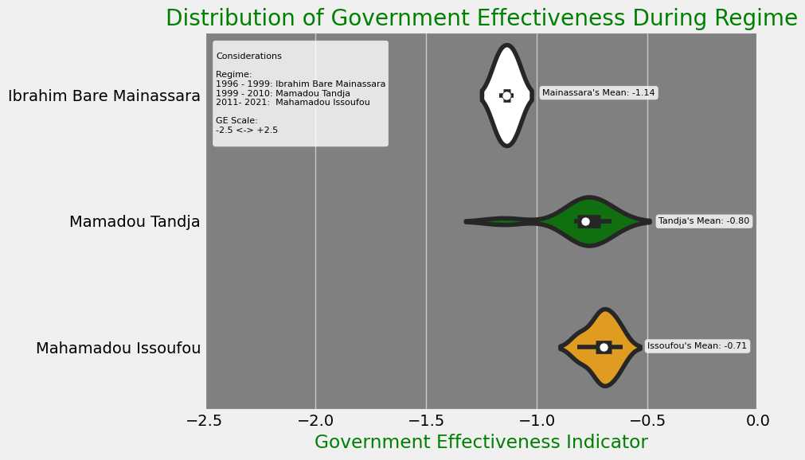
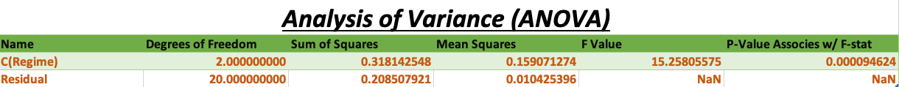

# Niger's Political Shift: Examining the Possible Factors Driving the 2023 Instability

Image Source:https://www.bloomberg.com/news/articles/2023-08-05/nigerian-lawmakers-seek-diplomatic-solution-to-niger-s-coup

Student: Joel P Himes

# Introduction
Thanks for joining me! I am excited to present my project on Niger's Political Shift: Examining the Possible Factors Driving the 2023 Instability.\
\
This presentation will explore various aspects of the Niger World Bank dataset and address several analytical inquiries about the country's instability over the last 25 years.

# Background

Image Source:https://www.cnn.com/2018/05/10/politics/niger-american-troops-presence/index.html\

On 26 July 2023, Niger faced its fifth military coup since 1960. The presidential guard detained President Bazoum, and their commander general declared himself the new junta leader. The country's borders were closed, state institutions suspended, and a curfew was imposed.\
\
According to various sources, political instability, weak governance/corruption, economic troubles, factionalism, dissatisfaction within the military or military spending, weak democratic institutions, history of coups, and extreme poverty are chief indicators that drive coups. 

Content Source: https://www.bbc.com/news/world-africa-66320895
\
Content Source: https://www.econstor.eu/bitstream/10419/156099/1/ile-wp-2016-3.pdf 

# Relevant Coup Timeline

Image Source:https://www.nytimes.com/2023/07/27/world/africa/niger-coup-president-bazoum.html

This is a detailed timeline of Niger's tumultuous journey over the span of nearly three decades, highlighting the country's political instability, characterized by coups and transitions in leadership.

1996:\
Army officers stage a coup overthrowing President Mahamane Ousmane and Prime Minister Hama Amadou in January, saying a political deadlock had threatened economic reforms, incurring the anger of former colonial power France.

Lieutenant Colonel Ibrahim Bare Mainassara, the armed forces chief of staff, becomes the country’s leader, saying the aim of the coup was to allow a new start and not to end multiparty democracy.

1999:\
Mainassara is killed in April by dissident soldiers in an ambush at Niamey airport, paving the way for a third coup in the country’s tumultuous history. Daouda Malam Wanke, the commander of the presidential guard, takes power before announcing that there would be an elected president and a return to civilian rule by 2000.

Mamadou Tandja wins Niger’s presidential election, defeating Mahamadou Issoufou, a former prime minister. International observers called the election that followed the 1999 coup generally free and fair.

2010:\
A group of military leaders calling themselves the Supreme Council for the Restoration of Democracy (CSDR), led by General Salou Djibo, captures Tandja and his ministers after a gun battle. The constitution is suspended, and all state bodies are dissolved. The military government promises to turn Niger into “an example of democracy and of good governance” after accusing Tandja of amending the constitution.

Political tensions had been rising in Niger since Tandja dissolved the parliament in 2009 and extended his own mandate following a referendum beyond a second term. New legislative elections are held in early 2011, with Issoufou winning in a presidential run-off.

2021:\
The 2021 Nigerien coup d'etat attempt occurred on 31 March in the capital of Niger, two days before the Bazoum took office. 
The coup attempt was staged by elements within the military and was attributed to the alleged leader of the plot Captain Gourouza.

2023:\
On Wednesday, July 26, members of the presidential guard, led by General Omar Tchiani, cut off the presidential palace in Niamey and detain Bazoum inside, sparking regional and international concern about instability. The military announces that all institutions are suspended, land and air borders are closed, and a curfew is implemented.

Niger’s Foreign Minister Hassoumi Massoudou calls on the country’s soldiers to release President Bazoum and settle their demands through dialogue. The Economic Community of West African States (ECOWAS), the United States, France, and the United Nations also strongly condemn the coup, calling it “unconstitutional”.

Content Source: https://www.aljazeera.com/news/2023/7/27/timeline-a-history-of-coups-in-niger  

# Analytical Goals

Image Source:https://en.wikipedia.org/wiki/Coat_of_arms_of_Niger

Analysis:\
As mentioned above, Niger underwent a significant political shift that led to noticeable instability. Unraveling the factors driving this turbulence is vital for understanding Niger's trajectory and shaping policies that could foster stability in the region. This analysis revolves around six analytical goals:

(1) Niger Governance: Examine Three World Governance Indicators from 1996 to 2022  (26 years).\
By examining the World Governance Indicators for 26 years (1996-2022), This analysis seeks to understand how governance trends may have influenced the current political climate.\
\
(2) Niger Economic Health: Explore Economic Indicators over the specified time frame.\
Economic indicators over the past decades are a barometer for a nation's prosperity and resilience.\
\
(3) Niger Leadership: Highlight Leadership Regime Effectiveness.\
Leadership plays a pivotal role in steering the direction of a nation.\
\
(4) Niger Leadership: ANOVA on Government Effectiveness.\
Utilizing an Analysis of Variance (ANOVA) on government effectiveness, this goal aims to statistically determine if there were statistically significant variations in governance effectiveness over different leadership periods.\
\
(5) Niger Foreign Aid: Uncover Data Points Related to Foreign Assistance.\
Foreign assistance can influence a country's politics as a stabilizing force or a potential source of conflict. By focusing on aid from some of the top countries, This endeavor can uncover if external monetary flows are a dependent part of stabilizing the Niger economy.\
\
(6) Niger Foreign Aid: Regression Model - DAC Flows & Niger GCF.\
Taking a quantitative approach, this goal employs a regression model to investigate the relationship between Development Assistance Committee (DAC) flows and Niger's Gross Capital Formation (GCF). Understanding this relationship can elucidate how foreign aid impacts Niger's economic structure and, consequently, its stability.

# Stakeholder Value

Image Source:https://www.alamyimages.fr/deux-drapeaux-des-etats-unis-et-du-niger-experience-professionnelle-de-haute-qualite-illustration-tridimensionnelle-image353769580.html

Analysis:\
Niger's recent political instability holds international implications, notably for U.S. counterterrorism initiatives. A retrospective analysis of its political stability, leadership trends, economic health, and foreign aid reliance is essential to grasp the base of the 2023 political shift.

Key Points:
- “So what?”: Niger's significance to U.S. counterterrorism efforts in Africa lies in its cooperation, hosting U.S. drone bases, American Special Forces, and logistics experts engaged in operations against Boko Haram and ISIS affiliates.

- Informed Decision-Making for Foreign Policy: Analyzing historical data on political stability, leadership, economic health, and reliance on foreign aid. Stakeholders can gain insights into the country's historical political landscape and how it may have contributed to the coup.

- Conflict Resolution for the UN and DAC Participants: The data analysis can help identify potential triggers or contributing factors to political instability in Niger.

Content Source: https://www.npr.org/2023/07/27/1190463279/niger-coup-us-counterterrorism-boko-haram-isis

# Describing the Data

Image Source:https://www.airforcetimes.com/news/your-air-force/2020/04/02/air-force-botched-building-its-new-air-base-in-africa/

Analysis:\
The dataset was curated from the World Bank to capture a 25/26 year snapshot, consisting of 1478 rows and 30 distinct columns, offering a comprehensive glimpse into Niger's evolving political and economic scenario. The most notable features encompass World Governance Indicators like Political Stability, Control of Corruption, Government Effectiveness, and crucial Economic Indicators such as Inflation, GDP, Unemployment, and Gross Capital Formation. 

Additionally, insights into Foreign Aid are represented through DAC Flows & Net ODA. Regarding data categorization, features are classified as either strings or objects, like the 'Indicator/Code,' or as floating numbers representing monetary values in USD, percentages, or aggregate indicators. Despite the expansive time frame, most data trimming significantly reduced data gaps, ensuring an almost seamless exploration of leadership periods. Nevertheless, any persisting missing data was prudently addressed, tailoring solutions to each analytical goal.

Dataset: 
- Trimmed down for 25/26 year time frame (1478 Rows, 30 Columns).

Interesting Features:
- World Governance Indicators (Political Stability, Control of Corruption, Government Effectiveness).
- Economic Indicators (Inflation, Gross Domestic Product, Unemployment, Gross Capital Formation).
- Foreign Aid (DAC Flows & Net ODA)

Categorization of Features: 
- String / Object (Indicator / Code)
- Float (Either USD, Percent, Aggregate Indicator)

Missing Data: 
- Minimized a lot of the missing data through the trimming to a 25/26 years time frame in most cases. 
- This worked well in terms of exploring the leaders by years in power. 
- Missing data in columns was handled by an Analytical Goal, case by case basis.

# Niger Governance: Examine Three World Governance Indicators from 1996 to 2022 (26 years).

Analysis:\
The Worldwide Governance Indicators offer an aggregate/comprehensive lens into nations' governance quality, spanning six crucial dimensions. For Niger, three stand out: Political Stability (PV.EST), reflecting the nation's vulnerability to unrest and violence, has seen a negative trend, hinting at growing instability. The Control of Corruption (CC.EST), which gauges governmental integrity and mostly lingers in negative territory for Niger, points to sustained challenges in curbing corruption. Lastly, Government Effectiveness (GE.EST), a measure of bureaucratic competence and service delivery, oscillates but frequently remains negative, indicating persistent governmental inefficiencies. These insights, sourced from varied metrics such as public trust and infrastructure quality, illuminate the governance hurdles Niger has to deal with.

- Political Stability (Indicator Code: PV.EST):
    * Overall: This indicator evaluates the likelihood of political instability, social unrest, and violence within a country. It reflects political stability and the absence of armed conflict or terrorism. A higher score implies a more secure and stable political environment, which is crucial for sustainable economic development and social progress.
    * The values for Political Stability range from positive 2.5 to negative 2.5.
    * Positive values (greater than 0) indicate better political stability, while negative values indicate a decline or deterioration in political stability.
    * For Niger, as the year progress, the values become increasingly negative, indicating a decline in political stability over time.
    * Sources (6 reps - Comprised of the following categories): Orderly transfers, Armed conflict, Violent demonstrations, Social unrest, International tensions / terrorist threat HUM Political terror scale, IJT Security risk rating, IPD Intensity of internal conflicts: ethnic, religious or regional, Intensity of violent activities of underground political organizations, Intensity of social conflicts (excluding conflicts relating to land), PRS Government stability, Internal conflict, External conflict, Ethnic tensions, WMO Protests, and riots. 

- Control of Corruption (Indicator Code: CC.EST):
    * Overall: This indicator assesses the prevalence of corruption in public institutions and society. It reflects the level of integrity within the government and the effectiveness of anti-corruption efforts. Higher scores on this indicator indicate lower levels of corruption, which fosters trust in public institutions, encourages foreign investments and enhances overall governance and development.
    * The values for Control of Corruption also range from positive 2.5 to negative 2.5.
    * Positive values (greater than 0) indicate better control of corruption, while negative values indicate a deterioration in controlling corruption.
    * For Niger, The values fluctuate over the years but tend to remain negative, indicating persistent challenges in controlling corruption.
    * Sources (7 reps - Comprised of the following categories): Corruption among public officials, Public trust of politicians, Diversion of public funds, Irregular payments in exports and imports, Irregular payments in public utilities, Irregular payments in tax collection, Irregular payments in public contracts, Irregular payments in judicial decisions, Is corruption in government widespread? Level of "petty" corruption between administration and citizens, Level of corruption between administrations and local businesses, Level of corruption between administrations and foreign companies, Corruption, Corruption index, Corruption

- Government Effectiveness (Indicator Code: GE.EST):
    * Overall: This indicator gauges the quality of public services, the efficiency of government operations, and the capability of the bureaucracy to implement policies and programs. It examines how well the government can provide essential services, enforce laws, and deliver public goods. Higher scores on this indicator indicate a more effective and competent government that can efficiently address societal challenges and meet the needs of its citizens.
    * The values for Government Effectiveness also range from positive 2.5 to negative 2.5.
    * Positive values (greater than 0) indicate better government effectiveness, while negative values indicate a decline in government effectiveness.
    * For Niger, as the year progresses, the values fluctuate but tend to remain negative, suggesting ongoing challenges in improving government effectiveness.
    * Sources(6 reps - Comprised of the following categories): Quality of bureaucracy / institutional effectiveness, Excessive bureacucracy / red tape, Quality of road infrastructure, Quality of primary education, Satisfaction with the public transportation system, Satisfaction with roads and highways, Satisfaction with the education system, Coverage area: public school, Coverage area: basic health services, Coverage area: drinking water and sanitation, Coverage area: electricity grid, Coverage area: transport infrastructure, Coverage area: maintenance and waste disposal, Bureaucratic quality, WMO Infrastructure disruption.
 
Content Source: https://info.worldbank.org/governance/wgi/

# Niger Economic Health: Explore Economic Indicators Over the Specified Time Frame.

Analysis:\
Negative GDP growth and deflation in an economy like Niger's can result from external and internal factors. External shocks, such as a drop in crucial export prices and domestic challenges like political instability or droughts, can hinder economic growth. Concurrently, deflation can arise from reduced consumer demand, excess production capacity, or import deflation from trading partners. The combined occurrence of negative GDP growth and deflation can create a self-reinforcing cycle where reduced spending from deflation further depresses economic activity. In Niger, vulnerabilities produced by regional instability can significantly influence these economic indicators.

Other Context:\
GDP Growth (annual %):
- A positive GDP growth rate suggests economic expansion, marked by increased production, job creation, and higher incomes. In contrast, a negative rate signifies economic contraction, with potential job losses and decreased spending. Sharp dips in GDP growth can hint at economic recessions influenced by global downturns or reduced domestic spending. At the same time, significant rises indicate economic booms driven by factors like increased investments or beneficial global economic shifts.

Inflation, Consumer Prices (annual %):
- A positive inflation rate indicates rising prices for goods and services, with moderate inflation beneficial as it promotes spending and investment. On the other hand, negative inflation, or deflation, signifies falling prices, potentially causing reduced spending and investment due to anticipated further declines. Substantial dips in inflation can signal economic stagnation, while significant rises, especially into hyperinflation, can erode purchasing power, escalating living costs, and devalue savings and investments.

Unemployment, Total (% of the total labor force):
- A positive unemployment rate shows that individuals are looking for jobs unsuccessfully, with higher rates potentially signaling an economic slowdown or recession. Conversely, a negative unemployment rate is implausible, as it would mean more people are employed than available in the labor force. Notably, a marked decrease in unemployment suggests a robust labor market and economic growth. At the same time, a significant increase can indicate economic distress, potentially leading to decreased spending, lower tax incomes, and societal issues.

Content Source: https://www.investopedia.com/articles/06/gdpinflation.asp
\
Content Source: https://www.investopedia.com/articles/markets/081515/how-inflation-and-unemployment-are-related.asp

# Niger Leadership: Highlight Leadership Regime Effectiveness.

Analysis:\
Niger's leadership landscape from 1996 to 2021 is marked by three distinct presidencies, each carrying a unique ideological stance and governance effectiveness score.

During Ibrahim Bare Mainassara's rule from 1996 to 1999, characterized by conservative Islamist laws, the Government Effectiveness Mean was -1.14. His tenure witnessed periods of instability, including coups, ultimately leading to his assassination in 1999. 

Mamadou Tandja, who governed from 1999 to 2010 with a conservative center-right approach, had a Government Effectiveness Mean of -0.80. Despite facing challenges in office, he was overthrown in a coup, which marked the end of his presidency.

From 2011 to 2021, Mahamadou Issoufou followed a social democratic, center-left ideology, with a Government Effectiveness Mean of -0.71. Notably, he maintained a positive alliance with the West and respected the limits of his power, voluntarily leaving office without attempting to extend his rule. 

The leadership of these three presidents in Niger saw varying levels of government effectiveness, with each leader representing different ideologies and facing unique challenges during their respective tenures. Ibrahim Bare Mainassara's governance was marked by lower effectiveness, while Mamadou Tandja and Mahamadou Issoufou's leadership achieved comparatively better government effectiveness despite facing political turmoil.

Content Source: https://www.britannica.com/biography/Ibrahim-Bare-Mainassara 
\
Content Source: https://www.britannica.com/biography/Mamadou-Tandja 
\
Content Source: https://www.britannica.com/biography/Mahamadou-Issoufou 

# Niger Leadership: ANOVA on Government Effectiveness.

Analysis:\
In the previous analysis of leadership, Ibrahim Bare Mainassara's governance displayed lower effectiveness compared to Mamadou Tandja and Mahamadou Issoufou, who exhibited relatively better government effectiveness despite facing political challenges. To ascertain the statistical significance of these government effectiveness averages, an ANOVA (Analysis of Variance) can be conducted. ANOVA is a statistical method used to compare means of three or more groups, determining if significant differences exist among them by assessing the variation between group means relative to the variation within the groups. 

Additionally, the post hoc test TUKEY HSD (Honestly Significant Difference) can be employed after ANOVA to identify specific group means that differ significantly. By utilizing ANOVA and TUKEY HSD, researchers aimed to draw meaningful conclusions regarding the substantial variations in government effectiveness among these leaders and the impact of their governance styles despite challenging circumstances.

# ANOVA Testing

Null Hypothesis (H0): The means of the different groups are equal. In other words, there is no effect of the factor on the dependent variable.

Alternative Hypothesis (H1): At least one group's mean differs from the others.

ANOVA results suggest that the factor Regime has a statistically significant effect on the outcome variable (GE). The means of at least two of the Regime levels are significantly different from each other. (But which two levels?)

Content Source: https://towardsdatascience.com/anova-test-with-python-cfbf4013328b

# Tukey HSD Testing

Null Hypothesis (H0): The means of the three groups being compared are equal.

Alternative Hypothesis (H1): The means of the three groups being compared are unequal.

When we reject the null hypothesis in the ANOVA, it does not tell us which groups are different. The Tukey HSD test helps us identify which specific group means are different from each other.

Significant differences were found between "Ibrahim Bare Mainassara Regime" and both "Mahamadou Issoufou Regime" and "Mamadou Tandja Regime", while "Mahamadou Issoufou Regime" and "Mamadou Tandja Regime" did not significantly differ in their means.

Content Source: https://www.statology.org/tukey-test-python/

# Niger Foreign Aid: Uncover Data Points Related to Foreign Assistance. 

Analysis:\
Regarding Niger, net official development assistance of 44 percent (in 2021) as a percentage of gross capital formation could be considered relatively high. This number indicates a significant reliance on foreign aid to finance a substantial portion of the country's physical and human capital investments. Niger heavily depends on external funding to support its development projects and faces challenges in generating sufficient domestic resources for its development needs. The high aid dependency may make the country vulnerable to fluctuations in aid inflows, impacting long-term planning and sustainability.

Measured Data Points:
- Net bilateral aid flows from the Development Assistance Committee (DAC) members are the disbursements of official development assistance (ODA) or official aid to countries and territories listed as ODA recipients. ODA comprises loans with concessional terms and grants to promote economic development and welfare. Official assistance is provided to more advanced countries and territories and is subject to similar terms and conditions as ODA. Part II of the DAC List, which included specific countries, was abolished in 2005, and data collection on official aid to these countries ended in 2004. DAC members, including various countries and the European Union Institutions, provide this aid, and the data is reported in current U.S. dollars, with regional aggregates and income group totals also included.

- Gross capital formation, also known as gross fixed capital formation, is an economic indicator that measures the total value of investments made in a country during a specific period. It includes investments in physical assets like machinery, equipment, buildings, and infrastructure, as well as education and training, contributing to the country's productive capacity and long-term economic growth. The components of gross capital formation consist of fixed capital formation, which covers investments in tangible assets used repeatedly in production processes, changes in inventories representing the value of stock changes held by businesses, and human capital formation, which encompasses investments in education and training to enhance the knowledge and skills of the labor force, ultimately leading to increased productivity and economic development.

Content Source: https://data.oecd.org/
\
Content Source: https://www.investopedia.com/terms/c/capital-formation.asp

# Niger Foreign Aid: Regression Model - DAC Flows & Niger GCF.

Simple Linear Regression Model:\
This model aims to predict Niger's Gross Capital Formation (a critical economic indicator reflecting the country's investment health - USD) using Net Bilateral Aid Flows from DAC donors (USD), a measure of international financial support. The relationship between these two variables could provide insights into how foreign aid impacts Niger's economic health and, subsequently, its political stability. A strong correlation might suggest that changes in foreign aid influence Niger's economic and, potentially, political landscape.

Analysis:\
The model results reveal a strong relationship between Net Bilateral Aid Flows from DAC donors and Gross Capital Formation, as indicated by the high R-squared value of 0.861. This value signifies that approximately 86.1% of the variation in Gross Capital Formation can be attributed to changes in Net Bilateral Aid Flows, showcasing a good fit of the model to the data. Furthermore, the small p-value (9.19e-12) for the F-statistic confirms the model's overall significance, suggesting that the independent variable, Net Bilateral Aid Flows, significantly impacts the dependent variable, Gross Capital Formation. The regression coefficients, with a negative Y-intercept of -4.749e+08 and a slope of 5.3360, imply that Gross Capital Formation decreases when Net Bilateral Aid Flows are zero. On average, it increases by 5.3360 units, with each unit rising in Net Bilateral Aid Flows, which are statistically significant based on their p-values and 95% confidence intervals.

The residual analysis indicates that the model appears satisfactory, showing no significant non-linearity or heteroscedasticity concerns, while the presence of some outliers does not significantly affect the overall model performance. Multicollinearity is not an issue as the Variance Inflation Factor (VIF) for the predictor variable (Amount_DAC) is 1, signifying no correlation with other predictors. In cross-validation, the model's predictions exhibit a mean squared error (MSE) of 5.2248430324784666e+17 units squared and a root mean squared error (RMSE) of approximately 722,830,756.99 units. The interpretation of RMSE's adequacy should consider the scale of Gross Capital Formation (Amount_GCF). If typical values lie in the billions, the RMSE indicates a satisfactory model fit. Overall, these model insights provide solid information for understanding the relationship between Net Bilateral Aid Flows (USD) and Gross Capital Formation (USD) for Niger.

Model Results:
- R-squared: This value ranges from 0 to 1 and represents the proportion of the variance for the dependent variable (Gross Capital Formation) that's explained by the independent variable (Net Bilateral Aid Flows from DAC donors). Your R-squared is 0.861, which means that 86.1% of the variability in Gross Capital Formation can be explained by Net Bilateral Aid Flows. This is a high R-squared, indicating a good fit of the model to the data.

- Adj. R-squared: This is the R-squared value adjusted based on the number of predictors in the model. In this case, it is 0.855. It is a more accurate measure of the goodness-of-fit, especially when comparing models with different numbers of predictors.

- F-statistic and Prob (F-statistic): The F-statistic is used to test the overall significance of the model. The null hypothesis would be that all of the regression coefficients are equal to zero. The Prob (F-statistic) is the probability that 'we' would get the computed value of F if the null hypothesis were true. In this case, the p-value is extremely small (9.19e-12), suggesting that at least some of the regression coefficients are not zero, i.e., the independent variable does have an effect on the dependent variable.

- coef (const and Amount_DAC): The const coefficient is your Y-intercept. It means that when Net Bilateral Aid Flows are zero, the Gross Capital Formation is -4.749e+08. The Amount_DAC coefficient is the slope of your regression line. It means that for each unit increase in Net Bilateral Aid Flows, the Gross Capital Formation increases by 5.3360 units, on average.

- P>|t| (const and Amount_DAC): These are the p-values associated with the null hypothesis that the respective coefficient is equal to zero (the variable has no effect). In both cases, the p-values are less than 0.05, suggesting that the intercept and slope are significantly different from zero.

- [0.025 0.975]: These are the 95% confidence intervals for the coefficients. If the interval does not include zero, it suggests the coefficient is statistically significant at the 5% level. Both intervals for const and Amount_DAC do not include zero, so they are statistically significant.

Content Source: https://www.geeksforgeeks.org/interpreting-the-results-of-linear-regression-using-ols-summary/

# Residual Analysis
- Overview: Residuals are the differences between the observed values and those predicted by a statistical model.

- Nothing outstandingly nonlinear or Unequal Error (Heteroscedasticity).

- If the residuals are randomly scattered around zero, it suggests a good fit for the model.

 

Content Source: https://www.scaler.com/topics/data-science/residual-analysis/

# Multicollinearity Check
- Overview: Multicollinearity occurs when two or more independent variables in a regression model are highly correlated. This makes it difficult for the model to isolate the individual effect of each predictor.

- VIF for the Amount_DAC variable (coefficient) is 1, which is the minimum possible value for VIF, indicating that there is no multicollinearity.

- Amount_DAC is not correlated with any other predictor variables in the model.

Content Source: https://www.analyticsvidhya.com/blog/2020/03/what-is-multicollinearity/

# Cross-Validation Analysis
- Overview: Cross-validation is a technique used to assess how a predictive model will generalize to an independent dataset. It involves dividing the dataset into multiple subsets and using these subsets to train and test the model iteratively.

- MSE: On average, The model's predictions are 5.2248430324784666e+17 units squared away from the actual value.

- RMSE: By taking the square root of the MSE, we get an error term that is in the same units as the original data.

- In this case, your RMSE is approximately 722,830,756.99. This means that, on average, the model's predictions are about 722.83 million units away from the actual value.

- Particularly, the scale of the 'Amount_GCF' variable is the key here.

- If the typical 'Amount_GCF' values are in the range of billions, an RMSE of 722.83 million may indicate a good model fit.

- If the typical 'Amount_GCF' values are in the millions, the model will likely not fit the data well.

Content Source: https://www.statisticshowto.com/cross-validation-statistics/

# Summary
The presentation delves deep into the historical events and trends that have shaped Niger's political instability, spotlighting decades marred by governance issues and economic setbacks. It highlights pivotal determinants such as political upheavals, financial frailties, and an entrenched reliance on foreign aid. These elements offer possible insights into the cyclical shifts plaguing Niger's political evolution.

# Contact Information
Thank you for your time & attention during the presentation.\
\
If you have further questions or want to explore the project in more detail, please get in touch with me. Here are my contact details:
\
\
Student: Joel P Himes\
\
GitHub: Joel H\
\
Email: himejoel2107@gmail.com\
\
Link to presentation: https://docs.google.com/presentation/d/1i2jn69D6CK2GCtOxcSE4gZjK_ymrcDGjuduiInNvH_o/edit?usp=sharing \
\
Link to Repo: https://github.com/joelphimes/Niger-Political-Shift-Examination \
\
Link to Dataset: https://data.worldbank.org/country/niger
