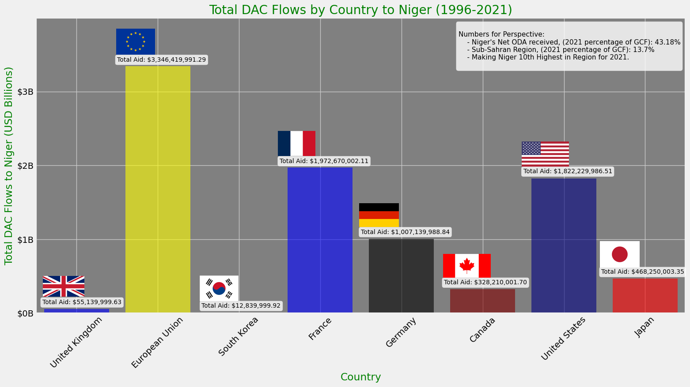

# Niger Political Shift Examination

Image Source:https://www.bloomberg.com/news/articles/2023-08-05/nigerian-lawmakers-seek-diplomatic-solution-to-niger-s-coup

Student: Joel P Himes

# Introduction
Thanks for joining me! I am excited to present my project on Niger's Political Shift: Examining the Possible Factors Driving the 2023 Instability.\
\
This presentation will explore various aspects of the Niger World Bank dataset and address several analytical inquiries about the country's instability over the last 25 years.

# Background

Image Source:https://www.cnn.com/2018/05/10/politics/niger-american-troops-presence/index.html\

On 26 July 2023, Niger faced its fifth military coup since 1960. The presidential guard detained President Bazoum, and their commander general declared himself the new junta leader. The country's borders were closed, state institutions suspended, and a curfew was imposed.\
\
According to various sources, political instability, weak governance/corruption, economic troubles, factionalism, dissatisfaction within the military or military spending, weak democratic institutions, history of coups, and extreme poverty are chief indicators that drive coups.

Content Source: https://www.bbc.com/news/world-africa-66320895
\
Content Source: https://www.econstor.eu/bitstream/10419/156099/1/ile-wp-2016-3.pdf 

# Relevant Coup Timeline

Image Source:https://www.nytimes.com/2023/07/27/world/africa/niger-coup-president-bazoum.html

1996:\
Army officers stage a coup overthrowing President Mahamane Ousmane and Prime Minister Hama Amadou in January, saying a political deadlock had threatened economic reforms, incurring the anger of former colonial power France.

Lieutenant Colonel Ibrahim Bare Mainassara, the armed forces chief of staff, becomes the country’s leader, saying the aim of the coup was to allow a new start and not to end multiparty democracy.

1999:\
Mainassara is killed in April by dissident soldiers in an ambush at Niamey airport, paving the way for a third coup in the country’s tumultuous history. Daouda Malam Wanke, the commander of the presidential guard, takes power before announcing that there would be an elected president and a return to civilian rule by 2000.

Mamadou Tandja wins Niger’s presidential election, defeating Mahamadou Issoufou, a former prime minister. International observers called the election that followed the 1999 coup generally free and fair.

2010:\
A group of military leaders calling themselves the Supreme Council for the Restoration of Democracy (CSDR), led by General Salou Djibo, captures Tandja and his ministers after a gun battle. The constitution is suspended, and all state bodies are dissolved. The military government promises to turn Niger into “an example of democracy and of good governance” after accusing Tandja of amending the constitution.

Political tensions had been rising in Niger since Tandja dissolved the parliament in 2009 and extended his own mandate following a referendum beyond a second term. New legislative elections are held in early 2011, with Issoufou winning in a presidential run-off.

2021:\
The 2021 Nigerien coup d'etat attempt occurred on 31 March in the capital of Niger, two days before the Bazoum took office. 
The coup attempt was staged by elements within the military and was attributed to the alleged leader of the plot Captain Gourouza.

2023:\
On Wednesday, July 26, members of the presidential guard, led by General Omar Tchiani, cut off the presidential palace in Niamey and detain Bazoum inside, sparking regional and international concern about instability. The military announces that all institutions are suspended, land and air borders are closed, and a curfew is implemented.

Niger’s Foreign Minister Hassoumi Massoudou calls on the country’s soldiers to release President Bazoum and settle their demands through dialogue. The Economic Community of West African States (ECOWAS), the United States, France, and the United Nations also strongly condemn the coup, calling it “unconstitutional”.

Content Source: https://www.aljazeera.com/news/2023/7/27/timeline-a-history-of-coups-in-niger  

# Analytical Goals

Image Source:https://en.wikipedia.org/wiki/Coat_of_arms_of_Niger

(1) Niger Governance: Examine Three World Governance Indicators from 1996 to 2022  (26 years).\
\
(2) Niger Economic Health: Explore Economic Indicators over the specified time frame.\
\
(3) Niger Leadership: Highlight Leadership Regime Effectiveness.\
\
(4) Niger Leadership: ANOVA on Government Effectiveness.\
\
(5) Niger Foreign Aid: Uncover data points related to foreign assistance from the US.\
\
(6) Niger Foreign Aid: Regression Model - DAC Flows & Niger GCF.

# Stakeholder Value

Image Source:https://www.alamyimages.fr/deux-drapeaux-des-etats-unis-et-du-niger-experience-professionnelle-de-haute-qualite-illustration-tridimensionnelle-image353769580.html

- “So what?”: Niger's significance to U.S. counterterrorism efforts in Africa lies in its cooperation, hosting U.S. drone bases, American Special Forces, and logistics experts engaged in operations against Boko Haram and ISIS affiliates.

- Informed Decision-Making: Analyzing historical data on political stability, leadership, economic health, and reliance on foreign aid. Stakeholders can gain insights into the country's historical political landscape and how it may have contributed to the coup.

- Conflict Resolution: The data analysis can help identify potential triggers or contributing factors to political instability in Niger.

Content Source: https://www.npr.org/2023/07/27/1190463279/niger-coup-us-counterterrorism-boko-haram-isis

# Describing the Data

Image Source:https://www.airforcetimes.com/news/your-air-force/2020/04/02/air-force-botched-building-its-new-air-base-in-africa/

Dataset: 
- Trimmed down for 25/26 year time frame (1478 Rows, 30 Columns).

Interesting Features:
- World Governance Indicators (Political Stability, Control of Corruption, Government Effectiveness).
- Economic Indicators (Inflation, Gross Domestic Product, Unemployment, Gross Capital Formation).
- Foreign Aid (DAC Flows & Net ODA)

Categorization of Features: 
- String / Object (Indicator / Code)
- Float (Either USD, Percent, Aggregate Indicator)

Missing Data: 
- Minimized a lot of the missing data through the trimming to a 25/26 years time frame in most cases. 
- This worked well in terms of exploring the leaders by years in power. 
- Missing data in columns was handled by an Analytical Goal, case by case basis.

# Niger Governance: Examine Three World Governance Indicators from 1996 to 2022 (26 years).

Analysis:

Overall: The Worldwide Governance Indicators measure the quality of governance in countries based on six dimensions: Voice and Accountability, Political Stability and Absence of Violence, Government Effectiveness, Regulatory Quality, Rule of Law, and Control of Corruption. These indicators provide valuable insights into the effectiveness of public institutions, governance structures, and the rule of law within a country, which are critical factors influencing economic and social development. 

- Political Stability (Indicator Code: PV.EST):
    * Overall:  This indicator evaluates the likelihood of political instability, social unrest, and violence within a country. It reflects political stability and the absence of armed conflict or terrorism. A higher score implies a more secure and stable political environment, which is crucial for sustainable economic development and social progress.
    * The values for Political Stability range from positive 2.5 to negative 2.5.
    * Positive values (greater than 0) indicate better political stability, while negative values indicate a decline or deterioration in political stability.
    * For Niger, as the year progress, the values become increasingly negative, indicating a decline in political stability over time.
    * Sources (6 reps): Orderly transfers, Armed conflict, Violent demonstrations, Social unrest, International tensions / terrorist threat HUM Political terror scale, IJT Security risk rating, IPD Intensity of internal conflicts: ethnic, religious or regional, Intensity of violent activities…of underground political organizations, Intensity of social conflicts (excluding conflicts relating to land), PRS Government stability, Internal conflict, External conflict, Ethnic tensions, WMO Protests and riots. 

- Control of Corruption (Indicator Code: CC.EST):
    * Overall: This indicator assesses the prevalence of corruption in public institutions and society. It reflects the level of integrity within the government and the effectiveness of anti-corruption efforts. Higher scores on this indicator indicate lower levels of corruption, which fosters trust in public institutions, encourages foreign investments and enhances overall governance and development.
    * The values for Control of Corruption also range from positive 2.5 to negative 2.5.
    * Positive values (greater than 0) indicate better control of corruption, while negative values indicate a deterioration in controlling corruption.
    * For Niger, The values fluctuate over the years but tend to remain negative, indicating persistent challenges in controlling corruption.
    * Sources (7 reps): Corruption among public officials, Public trust of politicians, Diversion of public funds, Irregular payments in exports and imports, Irregular payments in public utilities, Irregular payments in tax collection, Irregular payments in public contracts, Irregular payments in judicial decisions, Is corruption in government widespread? Level of "petty" corruption between administration and citizens, Level of corruption between administrations and local businesses, Level of corruption between administrations and foreign companies, Corruption, Corruption index, Corruption

- Government Effectiveness (Indicator Code: GE.EST):
    * Overall: This indicator gauges the quality of public services, the efficiency of government operations, and the capability of the bureaucracy to implement policies and programs. It examines how well the government can provide essential services, enforce laws, and deliver public goods. Higher scores on this indicator indicate a more effective and competent government that can efficiently address societal challenges and meet the needs of its citizens.
    * The values for Government Effectiveness also range from positive 2.5 to negative 2.5.
    * Positive values (greater than 0) indicate better government effectiveness, while negative values indicate a decline in government effectiveness.
    * For Niger, as the year progresses, the values fluctuate but tend to remain negative, suggesting ongoing challenges in improving government effectiveness.
    * Sources(6 reps): Quality of bureaucracy / institutional effectiveness, Excessive bureacucracy / red tape, Quality of road infrastructure, Quality of primary education, Satisfaction with the public transportation system, Satisfaction with roads and highways, Satisfaction with the education system, Coverage area: public school, Coverage area: basic health services, Coverage area: drinking water and sanitation, Coverage area: electricity grid, Coverage area: transport infrastructure, Coverage area: maintenance and waste disposal, Bureaucratic quality, WMO Infrastructure disruption.
 
Content Source: https://info.worldbank.org/governance/wgi/

# Niger Economic Health: Explore Economic Indicators over the specified time frame.

Analysis:

Overall:\
(Making Sense of the Negative GDP and Negative Inflation): Negative GDP growth and deflation in an economy like Niger's can result from external and internal factors. External shocks, such as a drop in crucial export prices and domestic challenges like political instability or droughts, can hinder economic growth. Concurrently, deflation can arise from reduced consumer demand, excess production capacity, or import deflation from trading partners. The combined occurrence of negative GDP growth and deflation can create a self-reinforcing cycle where reduced spending from deflation further depresses economic activity. In Niger, vulnerabilities produced from regional instability can significantly influence these economic indicators.

Other Context:

GDP Growth (annual %):\
A positive GDP growth rate suggests economic expansion, marked by increased production, job creation, and higher incomes. In contrast, a negative rate signifies economic contraction, with potential job losses and decreased spending. Sharp dips in GDP growth can hint at economic recessions influenced by global downturns or reduced domestic spending. At the same time, significant rises indicate economic booms driven by factors like increased investments or beneficial global economic shifts.

Inflation, Consumer Prices (annual %):\
A positive inflation rate indicates rising prices for goods and services, with moderate inflation beneficial as it promotes spending and investment. On the other hand, negative inflation, or deflation, signifies falling prices, potentially causing reduced spending and investment due to anticipated further declines. Substantial dips in inflation can signal economic stagnation, while significant rises, especially into hyperinflation, can erode purchasing power, escalating living costs, and devalue savings and investments.

Unemployment, Total (% of the total labor force):\
A positive unemployment rate shows that individuals are looking for jobs unsuccessfully, with higher rates potentially signaling an economic slowdown or recession. Conversely, a negative unemployment rate is implausible, as it would mean more people are employed than available in the labor force. Notably, a marked decrease in unemployment suggests a robust labor market and economic growth. At the same time, a significant increase can indicate economic distress, potentially leading to decreased spending, lower tax incomes, and societal issues.

Content Source: https://www.investopedia.com/articles/06/gdpinflation.asp
\
Content Source: https://www.investopedia.com/articles/markets/081515/how-inflation-and-unemployment-are-related.asp

# Niger Leadership: Highlight Leadership Regime Effectiveness.

Analysis:
\
\
Overall:\
During Ibrahim Bare Mainassara's rule from 1996 to 1999, characterized by conservative Islamist laws, the Government Effectiveness Mean was -1.14. His tenure witnessed periods of instability, including coups, ultimately leading to his assassination in 1999. 

Mamadou Tandja, who governed from 1999 to 2010 with a conservative center-right approach, had a Government Effectiveness Mean of -0.80. Despite facing challenges in office, he was overthrown in a coup, which marked the end of his presidency.

From 2011 to 2021, Mahamadou Issoufou followed a social democratic, center-left ideology, with a Government Effectiveness Mean of -0.71. Notably, he maintained a positive alliance with the West and respected the limits of his power, voluntarily leaving office without attempting to extend his rule. 

The leadership of these three presidents in Niger saw varying levels of government effectiveness, with each leader representing different ideologies and facing unique challenges during their respective tenures. Ibrahim Bare Mainassara's governance was marked by lower effectiveness, while Mamadou Tandja and Mahamadou Issoufou's leadership achieved comparatively better government effectiveness despite facing political turmoil.
\
\
Leadership:
\
1996 - 1999: Ibrahim Bare Mainassara: 
- Conservative Islamist laws.
- Assassinated in 1999.
- Seized and lost power in coups.

1999 - 2010: Mamadou Tandja:
- Conservative Center-Right.
- Lost power in a coup.
- Died of illness in 2020.

2011- 2021:  Mahamadou Issoufou:
- Social Democracy, Center Left.
- Ally of the West.
- Left power by respecting limits.

Content Source: https://www.britannica.com/biography/Ibrahim-Bare-Mainassara 
\
Content Source: https://www.britannica.com/biography/Mamadou-Tandja 
\
Content Source: https://www.britannica.com/biography/Mahamadou-Issoufou 

# Niger Leadership: ANOVA on Government Effectiveness.

Findings:\
ANOVA results suggest that the factor Regime has a statistically significant effect on the outcome variable (GE). The means of at least two of the Regime levels are significantly different from each other. (But which two levels?)

Findings:\
Significant differences were found between "Ibrahim Bare Mainassara Regime" and both "Mahamadou Issoufou Regime" and "Mamadou Tandja Regime", while "Mahamadou Issoufou Regime" and "Mamadou Tandja Regime" did not significantly differ in their means.

# Niger Foreign Aid: Uncover data points related to foreign assistance from the US. 

# Niger Foreign Aid: Regression Model - DAC Flows & Niger GCF.

# Contact Information
Thank you for your attention & time during the presentation.\
\
If you have further questions or want to explore the project in more detail, please get in touch with me. Here are my contact details:
\
\
Student: Joel P Himes\
\
GitHub: Joel H\
\
Email: himejoel2107@gmail.com\
\
Link to presentation: https://docs.google.com/presentation/d/1i2jn69D6CK2GCtOxcSE4gZjK_ymrcDGjuduiInNvH_o/edit?usp=sharing \
\
Link to Repo: https://github.com/joelphimes/Niger-Political-Shift-Examination \
\
Link to Dataset: https://data.worldbank.org/country/niger
